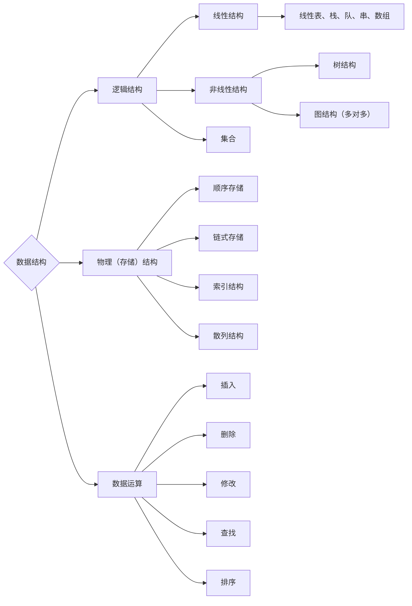

# Data_Structure_Mindmap

```mermaid
graph LR
A{数据结构} --> B1[逻辑结构]
A --> B2["物理（存储）结构"]
A --> B3[数据运算]

B1 --> B1_1[线性结构] --> B1_1_2["线性表、栈、队、串、数组"]
B1 --> B1_2[非线性结构]
B1 --> B1_3[集合]
B1_2 --> B1_2_1[树结构]
B1_2 --> B1_2_2["图结构（多对多）"]

B2 --> B2_1[顺序存储]
B2 --> B2_2[链式存储]
B2 --> B2_3[索引结构]
B2 --> B2_4[散列结构]

B3 --> B3_1[插入]
B3 --> B3_2[删除]
B3 --> B3_3[修改]
B3 --> B3_4[查找]
B3 --> B3_5[排序]
```

