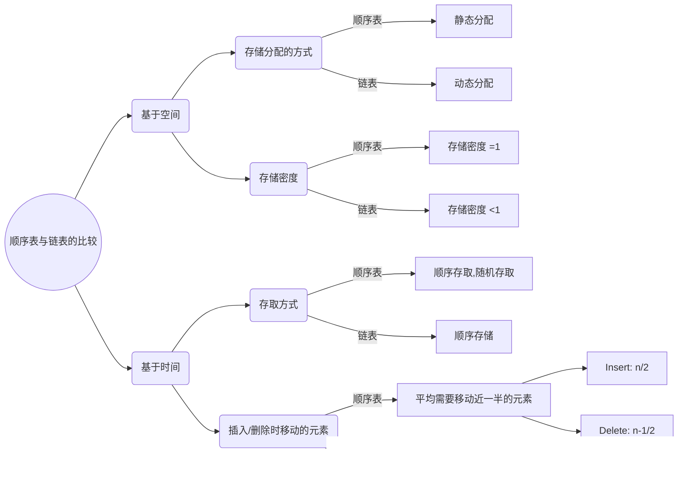

## 线性结构

数据元素的有序集（次序）

### 特征：

1. 唯一 第一元素
2. 唯一 最后元素
3. 唯一 后继（除最后）
4. 唯一 前驱（除第一）

## 抽样数据类型定义

数据对象 & 数据关系

```cpp
a[1] ~ a[i] ~ a[n]
// n: 表长，n=0时为空表
// i: 位序
```

基本操作

```cpp
// 结构初始化
InitList(&L); 操作结构：构造一个空的线性表

// 结构销毁
Destroy_List(&L);

//引用型操作：
//都有初始条件的
ListEmpty();
ListLenth(&L);
PriorElem(L, cur_e, &pre_e); //查找前驱
NextElem(L, cur_e, &nex_e); // 查找后继
GetElem(L, i, &e); // 用e返回L中第i个元素的值
LocateElem(L, e, compare()); // 返回L中第1个与e满足compare() == true的位序，否则返回0；
ListTraverse(L, visit())； // 对表中每个element依次调用visit函数

//加工型操作：
ClearList(&L); // 将L重置为空表
PutElem(L, i, &e); // L中第i个元素被赋上e的值
ListInsert(&L, i, e); // 在i之前插入新元素e， L的长度+1, 初始条件： L存在，1<=i<=LengthList(L) + 1
ListDelete(&L, i, &e); // 删除L的第i个元素，并用e返回其数值， L的长度-1，初始条件……
```

例题2-1：将A、B两个集合合并，得到并集

```cpp
void union(List &La, List Lb)
{
    int La_len = ListLenth(La);
    int Lb_len = ListLenth(Lb);
    for(int i=1;i<=Lb_len;i++)
    {
        GetElem(Lb,i,e);
        if(!LocateElem(La, e, equal())) 
            ListInsert(La, ++La_len, e);
    }
}
```

### 第2节 线性表的实现 顺序映像·顺序表

#### 基本概念

地址连续

基地址：线性表的起始地址

```cpp
#define LIST_INIT_SIZE 80
#define LIST_INCRESMENT 10
template<typename ElemType>
typedef struct{
    ElemType* elem;
    int length;
    int list_size;
};//SeqList 顺序表
//一维数组的空间
```

#### 具体实现

略

#### 总结

顺序表：表示方法

一组地址连续的存储空间，存储元素

借用一维数组描述

长度可变：动态分配：在insert的实现中特别重要

```cpp
template<typename ElemType>
Status ListInsert_Sq(SqList &L, int i, ElemType e){
    if(i<1 || i>L.length + 1) return Error;
    //存储空间满了，进行新内存的分配；
    if(L.length >= L.list_size){
        new_base = (ElemType * )realloc(L.elem, (L.list_size + LIST_INCREMENT) * sizeof(ElemType));
        if(!new_base)exit(OVERFLOW);
        L.elem = newbase;
        L.list_size += LIST_INCREMENT;
    }
    q = &(L.elem[i-1]);
    //从末位开始向前依次往后位移直到 i-1 的位置（q）
    for(p=&(L.elem[L.Length-1]);p>=q;--p) *(p+1) = *p;
    *q = e;
    ++L.Length;
    return OK;
}
/*
下面是 realloc() 函数的声明。
void *realloc(void *ptr, size_t size)
参数
ptr -- 
	指针指向一个要重新分配内存的内存块，该内存块之前是通过调用 malloc、calloc 或 realloc进行分配内存的。如果为空指针，则会分配一个新的内存块，且函数返回一个指向它的指针。

size -- 
	内存块的新的大小，以字节为单位。如果大小为 0，且 ptr 指向一个已存在的内存块，则 ptr 所指向的内存块会被释放，并返回一个空指针。
*/
```


**优点**

1. 随机存取
2. 表长为显

**缺点**

1. 删除、插入时移动元素大致移动n/2的情况
2. Test The Way Font Changes


### 第3节 线性表的实现 链式映像·单链表

地址任意

存储单元：节点
$$
元素（数据元素的映像）+指针（指示后继元素存储位置） = 节点（表示数据元素）
$$
**链表**

第一个元素a_1的**存储地址**作为**线性表的地址**，称作**头指针**

#### 链表的描述

```Cpp
Typedef struct LNode{
	ElemType data; // 数据域
    struct LNode * next; // 指针域
}LNode, *LinkList;
```

#### 操作实现

```Cpp
// List Insert()
Status ListInsert L(LinkList L, int pos, ElemType e)
{
    p = L;
    j=0;
    while(p && j<pos-1)
    {
        p = p->next;
        ++j;
    }
    if(!p || j > pos-1) return Error;
    // 生成新的结点
    s = (LinkList) malloc (sizeof(LNode));
    s -> data = e;
    s -> next = p -> next;
    p -> next = s;
    return OK;
}
```


略

```cpp
void CreateList_L(LinkList &L, int n){
    L = (LinkList) malloc (sizeof(LNode));
    L -> next = NULL; // 建立一个带“头结点”的单链表
    for(int i=n;i>0;--i){
        p = (LinkList) malloc (sizeof(LNode));
        scanf(&p -> data);//输入元素
        p->next = L->next;
        L->next = p; // 数据插入到表头L后面
    }
}// CreateList_L 
// 时间复杂度：O(ListLength(L))
```


#### 讨论时间复杂度

1. Union

   ``` cpp
   void union(List &La, List Lb){
       La_len = ListLength(La);
       Lb_len = ListLength(Lb);
       for(int i=1;i<=Lb_len;i++){
           GetElem(Lb, i, e);
           if(!LocateElem(La, e, equal()))
               ListInsert(La, ++La_len, e);
       }
   }
   /*
   控制结构：for循环
   基本操作：LocateElem(La, e, equal())
   以顺序映像实现时：
   	Insert操作时间复杂度为常量，主要考虑LocateElem()
   	T(n)=O(Lb_len*La_len);
   以链表映像实现时：
   	三个操作都是和表长成正比的
   	T(n)=O(lb_len*La_len);
   */
   
   // 按值有序排列的
   void Purge(List &La,List Lb){
       InitList(LA);
       La_len = ListLength(La);
       Lb_len = ListLength(Lb);
       for(int i=1;i<=Lb_len;i++){
           GetElem(Lb, i, e);
           if(!equal(en, e)){
               ListInsert(La, ++La_len, e);
               en = e;
           }
       }
   }//purge
   /*
   控制结构：for循环
   基本操作：GetElem(Lb, i, e);
   顺序表：线性的，O(Lb_len);
   链表：最坏的情况：O(Lb_len * La_len);
   */
   ```

   


## 顺序表与链表的比较



存储密度：
$$
存储密度={节点数据本身所占的存储量 \over 结点结构所占的存储总量}
$$


### 顺序表的算法效率分析

#### 时间效率

主要耗费：移动元素 

插入：n/2 --> O(n)

删除： (n-1)/2 --> O(n)

#### 空间复杂度

**不包含本身的空间**

没有占用辅助空间：O(1)


## 华中科技大学 数据结构


##### 对几个函数的介绍


```
#include<stdio.h>
#include<stdlib.h>
typedef struct node{
	char data;
	struct node *next;
}node;
node *p, *q, *head;
int n;
int m=sizeof(node);

void build()
{
	int i;
	head=(node*)malloc(m);
	p=head;
	for(int i=1;i<26;i++)
	{
		p->data=i+'a'-1;
		p->next =(node*)malloc(m);
		p=p->next;
	}
	// 单独处理最后一个结点。
	p->data = 26 + 'a' - 1;
	p->next = NULL; // !!!单链表的结尾结点指针域置空！！！
}

void display()
{
	p = head;
	while(p)
	{
		printf("%c",p->data);
		p=p->next;
	}
}


```

### 线性表的应用

#### 静态链表

定义一个**结构型数组**（每个元素都含有一个**数据域**和**指针域**），指针域为整型，称为游标。


### 其他类型链表


