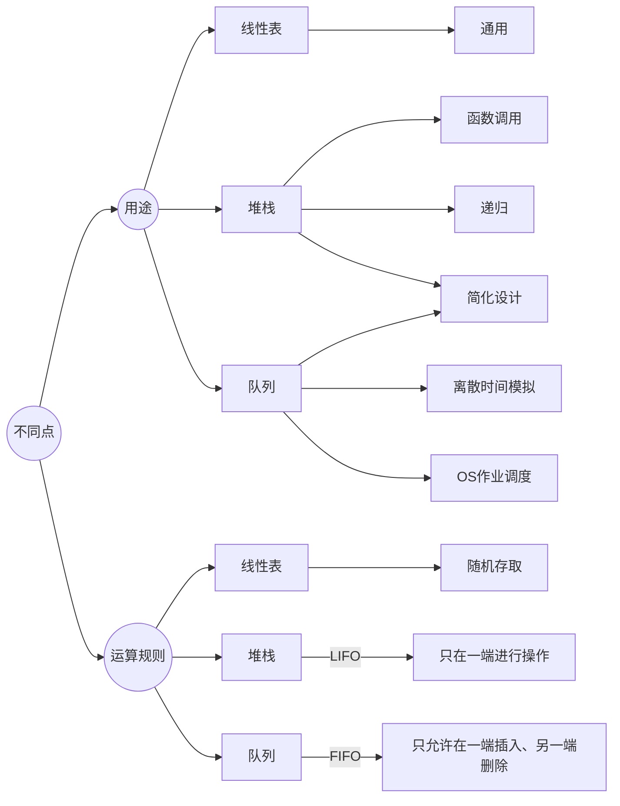

# Queue

## 基本概念

* **队尾插入**
* **队头删除**

*考虑平时排队找队尾*

* 逻辑结构：一对一，和线性表相同

* 存储结构：顺序队、链队、循环顺序队

* 运算规则：队首、队尾运算，访问节点依照**先进先出**（FIFO）原则

* 实现方式：入队、出队

* 基本操作：入队、出队、建空队列、判断空、满


##### 为啥设计队列：

* 模拟离散时间
* 操作系统的作业调度

### 双端队列


## 队列的链表表示和实现

```cpp
//结点类型的定义：
template<typename QElemType>
typedef struct QNode{
    QElemType data;
    struct QNode * next;
}Qnode, *QueuePtr;

//链队列类型的定义：
typedef struct{
    QueuePtr front;
    QueuePtr rear;
}LinkQueue; // 关于整个链队的总体描述
```

#### 队列示意图和备注


### 入队、出队实现

```cpp
Status EnQueue(LinkQueue &Q, QElemType e)
{//向队列Q插入新的队尾元素e
    p = (QueuePtr) malloc (sizeof(Qnode));
    if(!p) exit(Error); // 存储分配失败
    p->data = e;
    p->next = NULL;
    Q.rear->next = p;
    Q.rear = p;
    return OK;
}
```

````cpp
Status DeQueue(LinkQueue &Q, QElemType &e)
{
    //若队列不空，则删除Q的对头元素，用e返回其值
    //并返回True，否则Error
    if(Q.front == Q.rear) return Error;
    p = Q.front->next;
    e = p->data;
    Q.front->next = p->next;
    // 当仅有一个元素，即rear一开始就是Q.front->next时，需要将rear重新指向front
    // 否则删除p之后，rear悬空。
    if(Q.rear==p) Q.rear = Q.front; // Important！！ 
    free(p);
    return OK;
}
````

## 队列的顺序表示和实现

```cpp
#define MAXQSIZE 100
typedef struct{
    QElemType *base;// 队列的基地址
    int front; //队首指针，指向列头元素
    int rear; // 队尾指针，指向队尾元素的下一个位置
}SqQueue;
// 建对的核心语句
Q.base = (QElemType*) malloc(sizeof(QElemType)* MAXQSIZE); //动态分配空间
```

#### 示意图和注意事项


#### 基本操作：

* 初始化空队

```cpp
Q.front = Q.rear = 0;
```

* 队空条件

```cpp
Q.front == Q.rear
```

说明：不一定等于0

* 队满条件

```cpp
Q.rear == MAXQSIZE
```

说明：由于"Q.rear"作为一个数组下标一样的存在，所以当Q.rear==MAXQSIZE时，就已经满了

#### 操作示意图


### 假溢出

* 在顺序队列中，当指针已经到了数组上界，不能再有入队操作。但其实，数组中还有空的位置
* 如上图中J4, J5, J6入队之后
* 采用循环队列解决

## 顺序存储的循环队列

* 将顺序队列设想为首尾相连的环状空间
* 当Q.rear值超出空间最大位置时，令Q.rear=0
* Q.front "越界" 时也应有对应操作


#### 解决对空堆满判断条件相同（3个）

* 计数器，记录队列元素个数

* 标志位，删除时置1，插入时置0

  * front==rear 且 1 --> 因删除而相等 --> 队空
  * front==rear 且 0 --> 因插入而相等 --> 队满

* 人为浪费一个单元：申请N+1个空间而认为只有N个

  * 则队满特征变为：

  ```cpp
  front = (rear + 1)%N;
  ```

  * 队空仍是

  ```cpp
  front = rear;
  ```
  * 队列长度

  ```cpp
  L = (N+rear-front) % N;
  ```

  


#### 入队、出队的代码实现

```cpp
// 入队
Status EnQueue(SqQueue& Q, QElemType e)
{
    if((Q.rear+1)%MAXQSIZE == Q.front) return ERROR; // 队列满
    Q.base[Q.rear] = e;
    Q.rear = (Q.rear + 1) % MAXQSIZE;
    return OK;
}

// 出队
Status DeQueue(SqQueue& Q, QElemType& e)
{
    if(Q.rear == Q.front) return ERROR; // 队列空
    e = Q.base[Q.front];
    Q.front = (Q.front + 1) % MAXQSIZE;
    return OK;
}
```

## 队列应用

### 离散时间模拟

Back_Simulation_Code：

```git
git clone https://github.com/xinggangw/data_struct_teaching.git
```

### CPU循环调度问题

* n个任务，按顺序到来，每个人住需要执行t(ms)
* CPU的一个时间片为q(ms)
* 如果q(ms)之后任务尚未处理完成，则该任务将被移动到队尾，CPU随即开始处理下一个任务


### 小结




 
