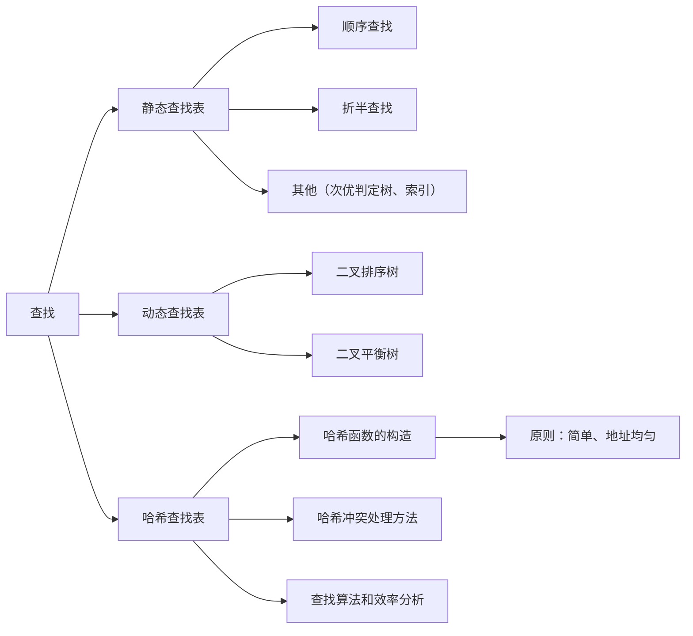

Search

* Data Struct = (D, S, P)
* 

* 静态查找表（线性、树形）
* 动态查找表（树形）
* 哈希查找（混合）

## 一些概念

查找的定义：在一堆数据中找到指定的元素

* 数据在本地时：查字、文件、字符
* 搜索问题、云计算&存储

查找效率 与 数据结构 密切关联

* 集合、线性、树形、网状

```markdown
* 查找表：由同种类型的数据元素构成的集合
	* 静态：不能插入、删除
	* 动态：可以插入、删除

* 关键字: 可以标记数据元素的数据项
	* 主关键字：唯一标识：DNA、指纹
	* 次关键字：识别若干记录

* 平均查找长度（ASL）：
	* 其中：p_i为搜索第i个元素的概率
	* c_i为搜索到第i个元素的比较次数
```

$$
ASL_{succ} = \sum_{i=0}^{n-1} p_i * c_i
$$

## 9.1 静态查找表

### 1. 表结构

* 顺序、链式

### 2. 无序表（集合）

* 集合结构：松散的，无序的
* 查找方法：从一端扫描到另一端（头->尾，尾->头）
  * 查找成功、查找失败分别返回

* 技巧：将0号单元或最后一个设置为“哨兵”
  * 免去了朝朝过程中每一步都要检查是否查找完毕
  * 设计算法，使最后查看哨兵，若在哨兵中找到目标，则可判断原集合中没有
* 算法分析：ASL_(succ) = (n+1)/2

### 3.有序表（线性）-折半查找

* 已知有序表，从左向右依次增大

* 与中间元素比较
  * 相等：成功
  * 小于中间元素：在左半区查找
  * 大于中间元素：在右半区查找

```markdown
* low, mid, high 三个指针
```

* 折半查找可用二叉树来描述：判定树
* 
  * 查找次数为结点的“层数-1”，每个概率相同，即可得出上述式子，算出ASL

* 算法分析
* 

### 4.静态树表（树形）

* 有序表中被查概率相等时，折半查找性能最优
* 被查概率不等时，折半查找不是最优

  * 对判定树加上概率作为权值，重新选根，建树，能算出新的ASL
* 问题：如何构造判定树
* 基本思路：概率大的结点与根节点的距离小，概率小距离大，类似于Huffman

### PH，路径之和

* 带权路径长度之和PH ，包括非叶子结点的部分

* 
  $$
  PH = \sum_{i=1}^{n}w_ih_i
  $$
  
  w_i = cp, c是查找概率，h_i是i结点层次
  
  可证：PH 与 ASL 成正比
  
* 构造 次优判定树

#### 次优判定树构造

* 从有序表R中取第i个记录构造根节点，使满足
  $$
  \Delta P = Min\{|\sum_{j=i+1}^{h}w_j-\sum_{j=l}^{i-1}w_j|\}
  $$

* 


* 例 9-2 需要调整
* 

### 平均查找长度分成功/不成功


* 备注：不成功而落到24右子：比较了2次；不成功而落到53左子：比较了2次。
* 罗列出所有不成功的情况
* 对于不成功的部分：相当于把他们视为“成功”，算其加权平均、

### 5.索引顺序查找（分块）

* 查找过程：分成几块，块中无序，块间有序；先确定待查所在块，再在块内查找
* 算法实现：
  * 用数组存放带查找记录
  * 建立索引表，结点含有最大关键字域和指针指向本块第一个结点的指针

## 9.2 动态查找表（树形结构）

* 表结构在查找过程中动态生成
* 若有，则查找成功
* 否则，插入关键字等于key的记录
* 二叉排序树

### 二叉排序树

1. 左子树 所有节点 小于 根
2. 右子树反之
3. 左右子树也是二叉排序树

* 在查找中动态生成


* 具体算法


* 二叉排序树的中序序列：有序序列

### 二叉排序树的插入和删除

#### 插入操作

* 小于根：左边走
* 大于根：右边走
* 边“查找”，边“插入”

#### 删除操作

* 原则：中序有序、高度不增加

* 删除叶子节点：记得释放空间
* 只有左子树/右子树：孩子顶替之
* 左右都有：在右子树中寻找中序遍历下的第一个结点，代替被删，再来处理（自己想……）

### 查找算法分析

* 比较次数：结点层次数（最多比较次数：树的深度：Log_2(n) + 1)
* 平均查找长度ASL:
  * 单支：n，ASL = (n+1)/2，退化为顺序查找
  * 于折半查找判定树相同：(log_2(n)+1)，ASL = log_2(n+1) - 1，折半查找

* 平均性能：每个查找概率相同，则ASL与log n 同数量级
* **平衡二叉树**

### 平衡二叉树

* 左右树是平衡二叉树
* 平衡因子Balance：该结点左子树与右子树的高度差：左子树高度 - 右子树高度，存在正负
  * 
* 所有结点，左、右子树深度只差 <= 1

* 左右结点高度只差小于等于1
* 对于一颗 n 个结点的 AVL树，其高度保持在 O(log_2(n)) 数量级，ASL也保持在 O(log_2(n)) 数量级


#### 平衡旋转调整之

* LL平衡旋转

  * 若在左子树插入节点，使其平衡因子从1增加到2；则进行一次顺时针旋转，中序序列不变

    

    

* RR平衡旋转


* LR平衡旋转


* RL平衡旋转


## 9.3 哈希查找

### 哈希表的概念

集合（散列） -> 顺序 -> 树

* 建立函数关系
* 关键字 存储位置 对应关系


* 构造哈希函数

* **冲突** ：多个关键字 映射到 同样的地址了

#### 两个问题

1. 构造好的哈希函数
   1. 简单，提高速度
   2. 得出的地址大致均匀分布，减少空间浪费
2. 好的解决冲突的方案

### 哈希函数的构造方法


#### 直接定址

$$
Hash(key) = a \times key + b
$$


#### 除留余数

$$
Hash(key) = key\%p
$$

* 选取合适的p：表长为m，则p<=m，且接近m或等于m。p一般选取质数

#### 乘余取整法

$$
Hash(key) = \lfloor B\times(A\times key \% 1) \rfloor
$$

* 0<A<1, B为整数

#### 数字分析


#### 平方取中


#### 折叠法


#### 随机法


### 冲突处理方法

* 开放定址法
* 链地址法
* 再哈希

#### 开放定址法

* 冲突产生，则寻找下一个空的哈希地址

##### Hash冲突的解决

1. 线性探测法
   $$
   H_i = (Hash(key)+d_i) \% m
   $$
   其中，d_i 为增量 = 1, 2, 3 .... m - 1

   

   * 查找时，先令d_i = 0, 若不对，则依次查找

2. 二次探测

   

3. 链地址

   将有相同Hash地址的记录成一个单链表，m个hash地址，m个点链表，动态的结构

   

4. 其他

略

### Hash查找及分析


* 装填因子: Alpha

$$
\alpha = {填入表中的元素个数 \over 哈希表的长度}
$$


* 平均查找长度（统计结果）


#### Hash查找在实际工程中的大量使用


## 本章小结



## 关于ASL的计算
* 顺序表查找


* 折半查找


* 分块查找


* 算法比较：


## 二叉树的左旋与右旋


